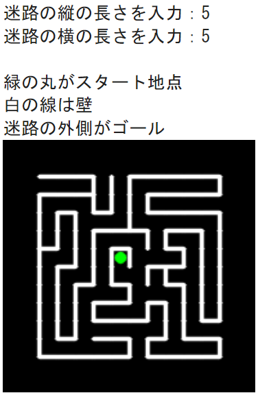

# Prog2kakushin
プログラミングⅡのGoogle colabを保存するためのリポジトリ
# プログラム１について
## 概要
大富豪で遊ぶことができるプログラム．

このプログラムでは、大富豪のルールを自分で設定し、そのルールでコンピュータと対戦することができる．大富豪を上手くなりたい人には役立つと思いこのプログラムを作成した．

なお、ジョーカーは１枚、階段は無しとなっている．

## 入力と出力
設定などは、出力される表示に従って数字で入力する．

大富豪でカードを場に出すときは、カードを「h2 s2 c2」などのように、半角スペース区切りで入力する．パスしたいときは「pass」と入力する．

カードは、１文字目がスート(ハート、クローバー、スペード、ダイヤ)をそれぞれ「h」,「c」,「s」,「d」に、２文字目以降が数字(3,4,5,6,7,8,9,10,J,Q,K,A,2)になるように入力する(例：ハートのクイーン：「hQ」)．なおジョーカーは「joker」と入力する．

## 工夫点
大富豪には様々なローカルルールがあるため、いくつか主流のものを実装し、設定でオンオフを切り替えられるよう工夫した．また、人数やラウンド数も変更できるようにした．

手札を見やすくするため、カードを自動で強さ順にソートしてから表示するようにした(革命で強さが反転した時にも対応)．
# プログラム２について
## 概要
数独(ナンプレ)を自動で作成、および自動で解いてくれるプログラム．

ナンプレの問題をランダムに作成してくれるため、何度でも新しい問題で楽しむことができる．

また、ナンプレの問題の答えを知りたいときにも便利なプログラムとなっている．
## 入力と出力
表示に従って数字で入力する．

ナンプレの問題及び答えは、数字の入っていない空白のマスは0と表示される．

問題を入力する場合は、上の列から順に、9桁の数字で入力する(例：「120080470」)．空白のマスは0として入力する．
## 工夫点
ナンプレの問題生成後、答えの表示をすぐにはせずに、答えを表示するかしないかを選ばせるようにした．

また、答えを表示しないを選んだあとでも、問題のリストから答えを確認できるようにした．

自動解析を行いたい問題を入力するとき、なるべく直感的に入力できるようにした．
# プログラム３について
## 概要
迷路をランダムに生成し、画像として出力するプログラム．

迷路で遊びたいと思ったときにすぐに迷路を作ってくれるプログラムがあると、便利だと思い、このプログラムを作成した．
## 入力と出力
迷路の縦と横の長さを整数で入力する．長さは1以上である必要がある．

↓入出力例

その後、迷路の簡易的なルールと迷路が描かれた画像が表示される．

迷路の形は長方形になっており、中央あたりにある緑色の円のマークがある場所がスタート地点、長方形の迷路の外側にたどり着けばゴールとなっている．なお、白の線は壁であり、この線を越えて通ることはできない．
## 工夫点
迷路のサイズを、好みに合わせて変えられるようにした．

また、迷路にある程度行き止まりが存在するようにし、途中で折り返すことなくスタートからゴールまで行くことのできる道が１通りのみになるようにした．
